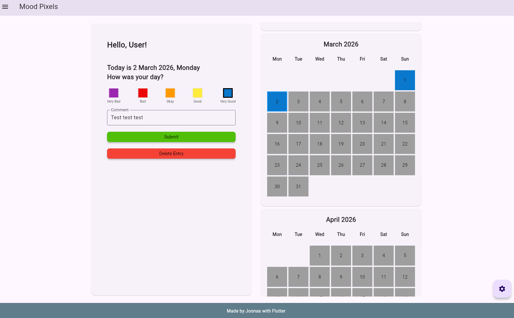

# Mood Pixels

Mood Pixels is a Flutter web application for tracking daily mood in a simple calendar view.

## Deployed Application

https://jooniv.github.io/dag_project1/

## How to Use

1. Open the deployed app in a browser.
2. On first launch, enter your name on the welcome screen.
3. On the home screen, write a daily entry and choose a mood.
4. Click a day in the calendar to open that specific date entry (`/entry/:dateTimeString`).
    - Scrolling to the top of the calendar view one can change the year
5. Open **Statistics** from navigation to view mood distribution and monthly activity.
6. Open **Settings** to change your name, customize mood colors, reset colors, or clear all data.

## Application Idea and Purpose

- **Idea:** A simple mood journaling app with one entry per day.
- **Purpose:** Quick mood tracking, with easy use and simple statistics.
- **Ease of use:** Clear navigation, simple form input, and immediate visual feedback through colored calendar days.

## Requirement Coverage

### 1) Clear idea, clear purpose, easy to use
- The app is focused on daily mood logging and trend reflection.
- UI flow is straightforward: Welcome -> Home (log mood) -> Calendar/Entry details -> Statistics/Settings.

### 2) Responsive layout with breakpoints and max width
- Responsive layouts are implemented for mobile/tablet/desktop (`ResponsiveWidget`).
- Breakpoints include xsMobile/mobile/tablet/desktop behavior changes.
- Large-screen content is constrained.

### 3) Form input + persistence across restarts
- Users enter name and daily mood/comment through forms.
- Data is persisted with Hive local storage (`entries` and `settings` boxes), so data remains after restart.

### 4) Data interaction + statistics
- Entered data can be opened per date from the calendar and edited.
- Statistics screen visualizes data.

### 5) Main screen + at least three distinct screens + path variable navigation
- Main screen: Home (`/`).
- Additional screens: Welcome (`/welcome`), Settings (`/settings`), Entry (`/entry/:dateTimeString`), Statistics (`/statistics`).
- Path variable is used by the Entry screen to display date-specific content.

### 6) Online deployment shared in documentation
- https://jooniv.github.io/dag_project1/

